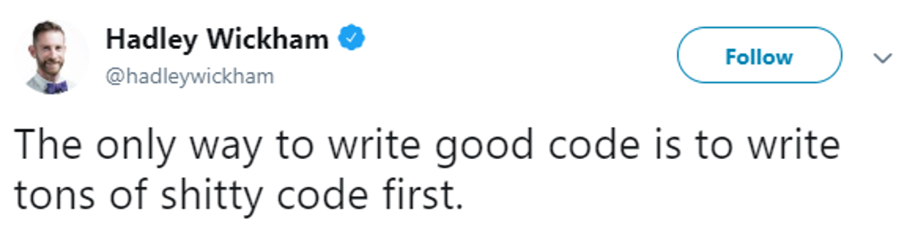
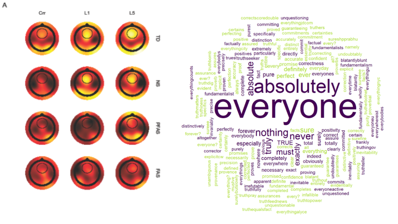
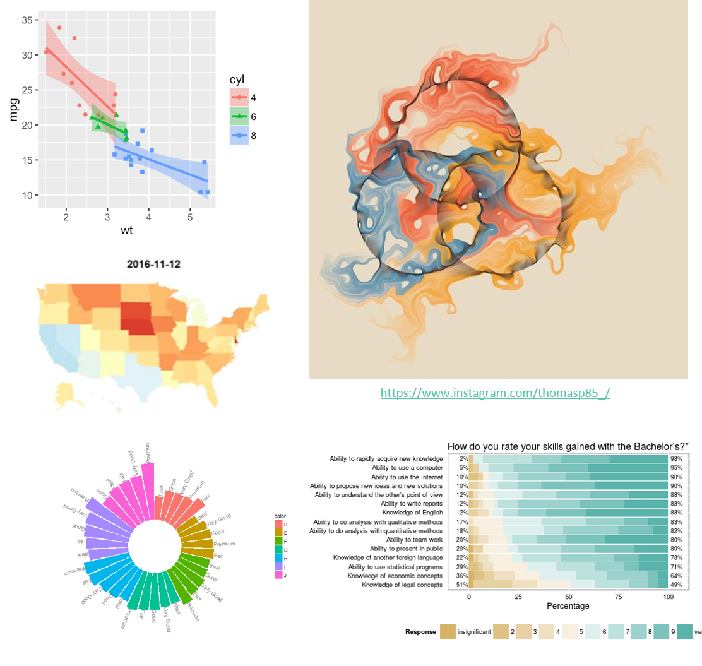
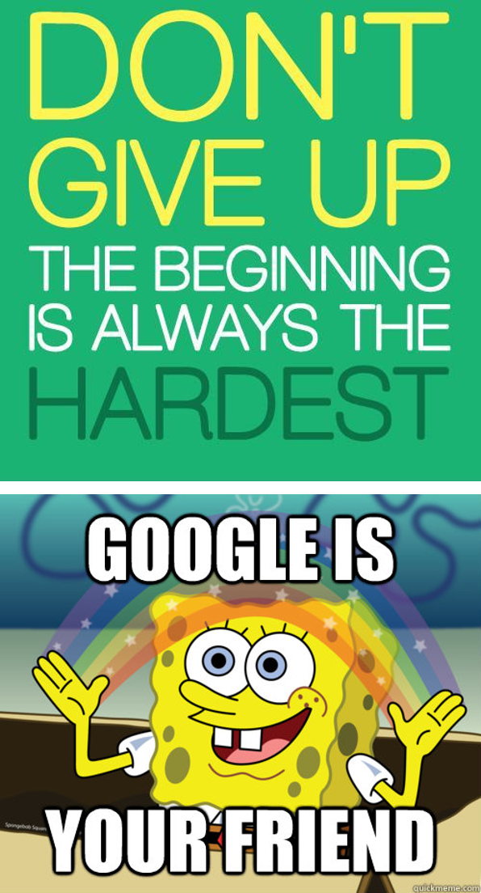

```{r setup, include=FALSE}
knitr::opts_chunk$set(echo = FALSE)
```

## What is R?

R is **free 🤑** and **open source** programming language for **statistical computing and graphics 📈** (but can also do a lot more).

## Why R?

> - Slowly [replacing SPSS](https://lindeloev.net/spss-is-dying/) (🤮) as the go-to stats software in social-sci.  
  - R is also significantly better than Excel for data analysis [(which you should not use for data analysis!)](http://www.bbc.com/news/technology-37176926).  
  - One of the [top 10 programming languages in industry](https://twitter.com/tylerburleigh/status/1172920043891503105).  
  - New statistical methods are implemented first in R!
<br><sub>(often never available in commercial applications...)</sub>  
  - Highly extendable – over 10,000 [community-developed packages](https://cran.r-project.org/web/packages/index.html)📦.  


## Why *not* R? {.build}

- Requires *coding* 😱, with no point-and-click user interface.  

- Slow learning curve...  

<center>
{width=80%}  
</center>

(I hope can write some shitty code together)  

<div class="notes">
Who has any coding exp?
</div>

## Why R after all? {.build}

Within R you can:  

- **Prepare** your data for analysis and plotting.  
- **Model** your data with all the familiar (and new!) stats model.  
- Create beautiful **plots and figures**.
- (Even write you whole thesis / papers...)  

Long term benefits:  

- All of this in a **reproducible manner**.  
- **Reuse code** on new data - just copy and paste!  
- Coding is becoming a **basic skill** for many jobs (in and out of academia).  

(Because you have to... 🤷️)

## Why R after all?

<div style="float: left; width: 50%;">
{width=100%}  

R can also be used for writing- writing:  

- [Papers and reports >>](https://doi.org/10.1525/collabra.192)  
- [CV written in R >>](https://pagedown.rbind.io/html-resume)  
- [Blogs >>](https://shouldbewriting.netlify.com/) ([make your own!](https://www.youtube.com/watch?v=ox_Ue9yzf-0))  
</div>

<div style="float: right; width: 50%;">
{width=100%}  
</div>


## What you will learn

- How to import data  
- How to prepare data  
- Summary statistics  
- Inferential statistics  
- Plotting  

## What you will *NOT* learn

- How to make your code more efficient.  
- How to write your own packages.  
- You will also not learn *everything*...

## Resources

- ***Free online books and courses***  
  - **R for Data Science** | [r4ds.had.co.nz/](r4ds.had.co.nz/)  
  - **Learning Statistics with R** | [learningstatisticswithr.com/](learningstatisticswithr.com/)  
  - **Statistical Thinking for the 21st Century** | [statsthinking21.org/](statsthinking21.org/)  
  - **R for Psychological Science** | [psyr.org/](psyr.org/)  
- ***Cheat sheets*** | [rstudio.com/resources/cheatsheets/](rstudio.com/resources/cheatsheets/)  
- ***Getting-help Guide*** | [blog.rsquaredacademy.com/getting-help-in-r-updated/](blog.rsquaredacademy.com/getting-help-in-r-updated/)  
- ***Stay up-to-date*** | [r-bloggers.com/](r-bloggers.com/)  


##

<div style="float: left; width: 70%;">
{width=100%}  
</div>

<div style="float: right; width: 30%;">
{width=100%}  
</div>
